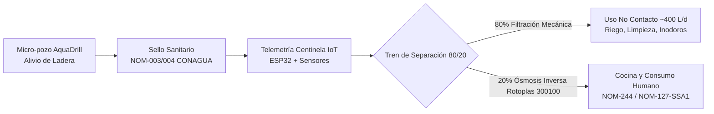
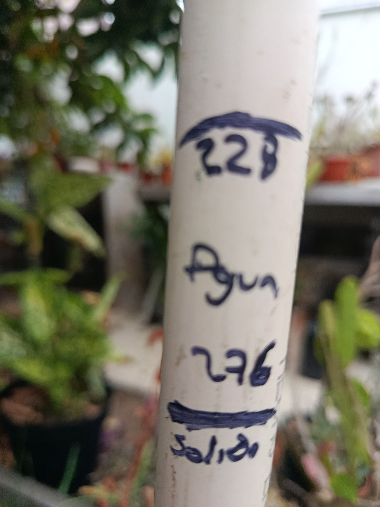
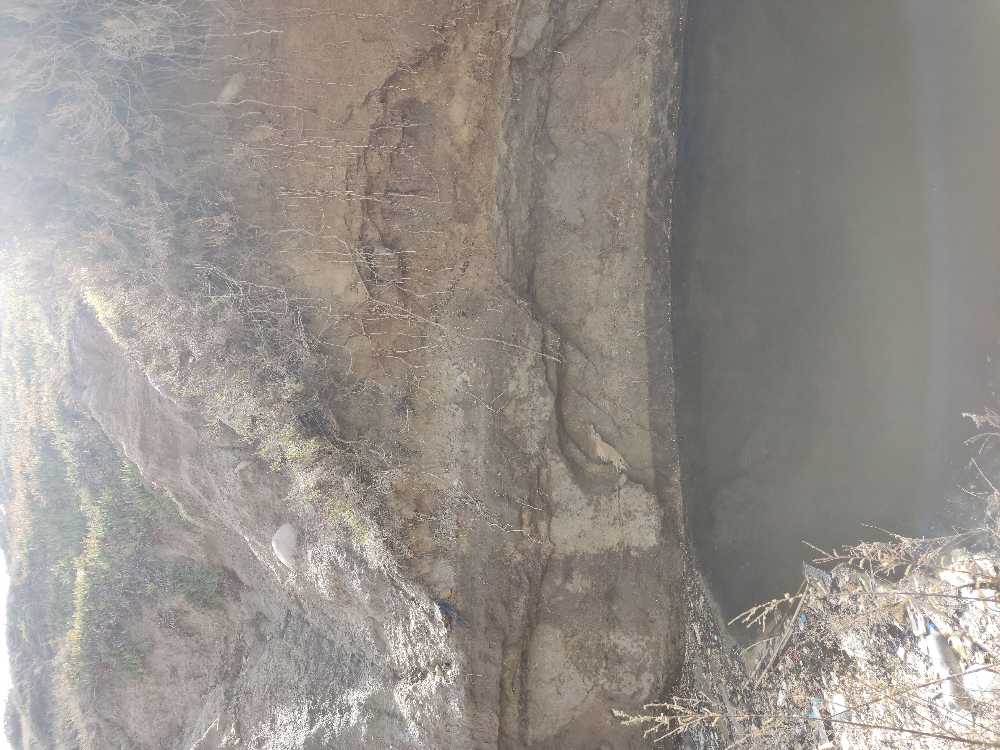
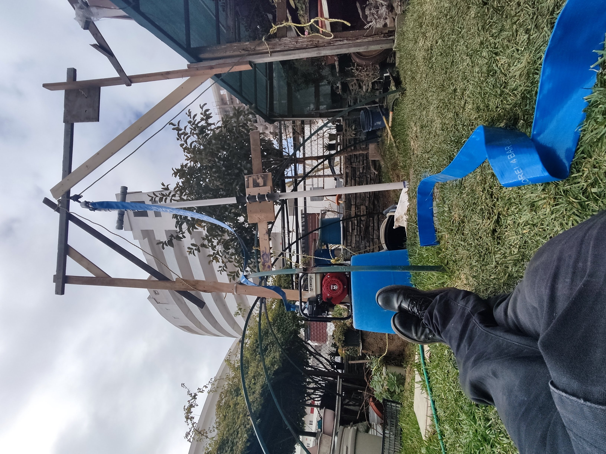
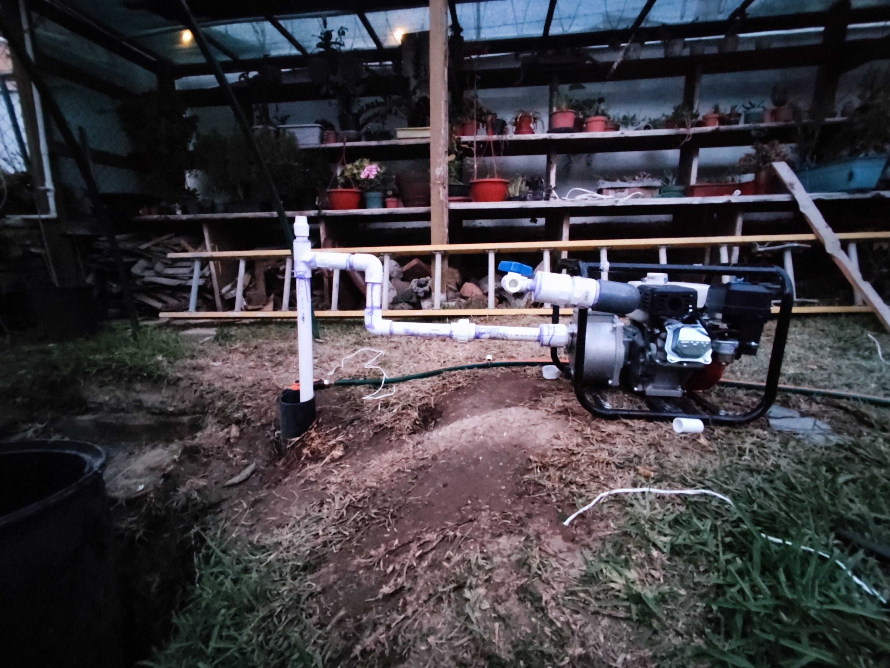
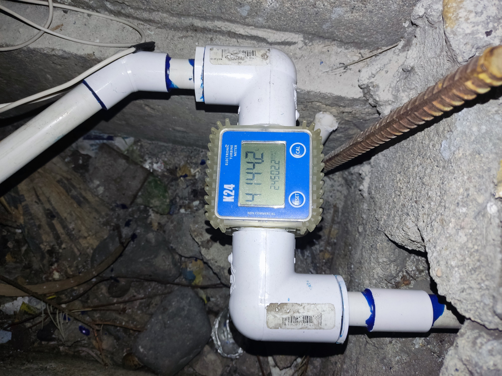
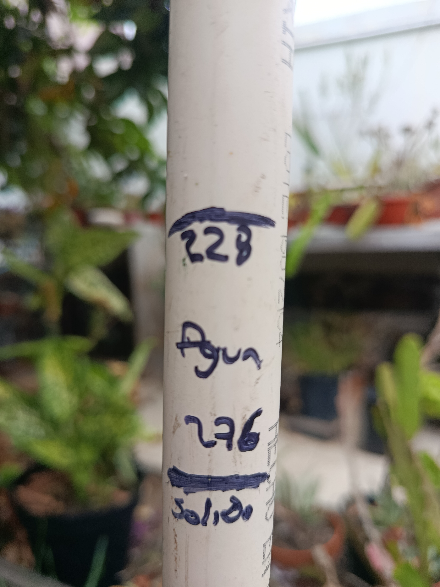

# 💧 Agua de GIA — AquaResiliencia Tijuana

> **Plataforma de Ciencia Comunitaria, Monitoreo Telemétrico IoT y Alivio Hídrico Descentralizado**  
> *Iniciativa enmarcada en el proyecto AquaResiliencia Tijuana / Colectivo 1, 2, 3 por Tijuana.*  
> **Repositorio de Código Abierto, Especificaciones Técnicas y Datos Ambientales.**

[](LICENSE)
[](hardware/)
[](lab/)
[](#6-ciencia-comunitaria-y-datos-abiertos)

---

## 📌 1. El Problema: La Paradoja Hídrica y Geotécnica de Tijuana

La ciudad de Tijuana, Baja California, enfrenta una paradoja socioecológica y geotécnica severa:

```
┌────────────────────────────────────────────────────────────────────────────────────────┐
│                        LA PARADOJA HÍDRICA DE TIJUANA                                  │
├──────────────────────────────────────────┬─────────────────────────────────────────────┤
│      ESCENARIO SUPERFICIAL               │          ESCENARIO SUBSUPERFICIAL           │
├──────────────────────────────────────────┼─────────────────────────────────────────────┤
│ • Estrés hídrico extremo y tandeos.      │ • ~30% del agua potable inyectada se pierde │
│ • Dependencia del Acueducto Río Colorado │   por fugas en la red vieja (~1,200 L/s).   │
│   (120 km, bombeo de +1,000 m de         │ • El agua fugada se infiltra y satura los   │
│   desnivel, alto costo energético).      │   estratos arcillosos impermeables a 2-6 m. │
│ • Pipas de agua comercial a costos de    │ • Incremento crítico de la presión de poro  │
│   hasta 5 a 8 veces el agua de red.      │   en arcillas expansivas (Fm. Tijuana).     │
│ • Comunidades sin suministro continuo.   │ • Deslaves y colapsos en laderas habitadas  │
│                                          │   (Sánchez Taboada, Lomas del Rubí, etc.).  │
└──────────────────────────────────────────┴─────────────────────────────────────────────┘
```

### 1.1 Inestabilidad de Laderas por Sobresaturación
La geología urbana de Tijuana está dominada por alternancias de areniscas, limolitas y arcillas bentoníticas (*Formación Tijuana* y *Formación Rosarito Beach*). Cuando el agua proveniente de pérdidas de red y escorrentías urbanas penetra estas formaciones sin un drenaje adecuado:
1. Las arcillas se saturan y pierden su resistencia al esfuerzo cortante al topar con estratos impermeables a 2–6 metros.
2. Se incrementa drásticamente la presión de poro y se generan planos de falla geomecánica activos.
3. Se detonan deslizamientos catastróficos que han destruido cientos de viviendas en colonias como **Sánchez Taboada**, **Lomas del Rubí**, **Camino Verde** y cañadas costeras.

### 1.2 La Oportunidad
El agua que desestabiliza las laderas no es un desecho inservible: **es un recurso somero cautivo (acuífero colgado y freático superficial) que puede ser extraído de forma controlada como medida de alivio piezométrico, mitigando el riesgo de derrumbe y abasteciendo a las comunidades locales.**

---

## ⚙️ 2. Solución Técnica Integral

El proyecto propone una intervención modular, frugal y científicamente regulada basada en cuatro pilares:



### 2.1 Micro-pozo de Alivio Piezométrico (Metodología AquaDrill)
* **Profundidad somera:** Entre 6 y 12 metros, interceptando mantos colgados y aluviones sin perforar estratos confinados profundos.
* **Perforación frugal por jetting hidráulico:** Uso de sarta hidráulica ligera y motobomba de alta eficiencia, minimizando la perturbación del terreno en zonas de acceso peatonal o cañadas estrechas.
* **Ademe y empaque de grava:** Tubería de PVC hidráulico Cédula 40 de 4" (100 mm) con ranurado milimétrico fino (0.020"), protegido por empaque de grava sílica seleccionada para evitar arrastre de partículas y azolve.
* **Sello Sanitario Normado:** Sellado anular superior con **bentonita sódica de alta expansión** desde la superficie hasta los primeros 2.5 metros, cumpliendo estrictamente con las normas oficiales **NOM-003-CONAGUA-1996** y **NOM-004-CONAGUA-1996** para proteger el pozo de escorrentías contaminantes superficiales.

### 2.2 Nodo Telemétrico Centinela IoT (ESP32)
Monitoreo y gobernanza algorítmica de la extracción para evitar la sobreexplotación del acuífero somero y garantizar la seguridad del agua:
* **Microcontrolador:** ESP32 DevKit v1 (30 pines) de bajo consumo, con conectividad Wi-Fi / MQTT y punto de acceso local de diagnóstico (`AquaResiliencia_AP`).
* **Sensor de Conductividad Eléctrica / TDS:** Monitoreo analógico continuo para detectar oportunamente cualquier intrusión de sales o contaminantes iónicos. Corte automático configurado a >1,800 ppm.
* **Sensor de Nivel Freático Dinámico:** Transductor ultrasónico impermeable IP67 (JSN-SR04T) que mide la columna de agua y detiene la extracción si el nivel desciende a menos de 2.0 m sobre la bomba.
* **Caudalímetro de Efecto Hall:** Sensor YF-S201 calibrado para contabilizar el volumen acumulado diario.
* **Actuador de Seguridad:** Relevador optoacoplado que energiza/desenergiza la bomba extractora, aplicando un límite diario de subsistencia comunitaria (500–600 L/día).

### 2.3 Tren de Tratamiento Desacoplado 80/20
El agua subterránea somera extraída se divide de manera inteligente para maximizar la vida útil de los sistemas de filtración:
1. **Fracción 80% (Uso de No Contacto y Doméstico General ~400 L/día):**
   * Pasa por filtración mecánica de sedimentos (spun poly 5 micras) y decloración básica.
   * Destinada a riego de áreas verdes comunitarias, limpieza de pisos, mitigación de polvo y descarga de inodoros (conforme a NOM-003-SEMARNAT-1997 / NOM-001-SEMARNAT-2021).
2. **Fracción 20% (Agua para Cocina y Consumo Humano Directo):**
   * Tratamiento avanzado en punto de uso mediante equipo comercial de **Ósmosis Inversa Rotoplas modelo 300100** certificado bajo **NOM-244-SSA1-2020** y estándar **NSF 58**.
   * Tren de 5 etapas: prefiltro de polipropileno (5 µm), carbón activado granular (GAC), carbón activado en bloque (CTO), membrana semipermeable de poliamida TFC y postfiltro pulidor remineralizador.
   * Lámpara germicida ultravioleta (UV 12W) para esterilización microbiológica final.

### 2.4 Certificación de Calidad del Agua (Laboratorio Acreditado EMA)
* Muestreo protocolizado bajo cadena de custodia formal.
* Ensayos analíticos ejecutados por laboratorio acreditado ante la **Entidad Mexicana de Acreditación (EMA)** bajo **NOM-127-SSA1-2021** (parámetros fisicoquímicos, metales pesados como As, Pb, Cd, nitratos, dureza, sulfatos y fluoruros).
* Protocolos detallados disponibles en [`lab/README.md`](lab/README.md).

---

## 📊 3. Datos Observados en Campo — Caso Piloto 001

El Caso Piloto 001 (ubicado en la zona general de **Playas de Tijuana, B.C.**) documenta observaciones directas de una experiencia real de campo:

| Observación / Parámetro | Resultado de Campo | Metodología / Estado |
| :--- | :---: | :--- |
| **Zona General** | **Playas de Tijuana, B.C.** | Zona costera; litología aluvial y horizontes someros de ladera |
| **Profundidad del pozo** | **8.0 a 9.0 m** | Perforación asistida por jetting hidráulico (AquaDrill) |
| **Nivel freático en reposo** | **~5.60 m** bajo superficie | Nivel freático estático observado en sondeo |
| **Columna de agua en pozo** | **~1.50 – 2.00 m** | Columna hídrica dentro del ademe ranurado |
| **Aporte hídrico continuo** | **~2.0 L/min (~600 L/día)** | Régimen de recarga sostenido en ciclos intermitentes |
| **Estrato permeable basal** | **Grava limpia y arena gruesa** | Estrato permeable favorable para filtro anular |
| **Bioensayos ecotoxicológicos** | **Sin toxicidad aguda observada** | Ensayos biológicos preliminares de campo (48h y 96h) |
| **Certificación completa EMA (NOM-127)** | **Programada en Fase 1** | Muestreo para metales pesados, fisicoquímica y microbiología |

> **Principio rector:** *Encontrar agua no significa automáticamente encontrar agua potable. Primero medimos, caracterizamos y analizamos con rigor de laboratorio; después decidimos su aprovechamiento.*

---

## 📸 4. Galería Visual de Campo (Evidencia Documental)

Registro fotográfico cronológico del Caso Piloto 001 en Playas de Tijuana:

| Etapa / Momento | Fotografía | Descripción Técnica |
| :--- | :---: | :--- |
| **Estado Actual (2026)** |  | **Operación e Integración Actual (2026):** Pozo consolidado, brocal elevado y gabinete de control listo para sensorización continua. |
| **01. Reconocimiento Geotécnico** |  | **Lectura de Farallón y Lloraderos (2022):** Detección de horizontes húmedos y filtración a 5–7 m en corte natural de ladera. |
| **02. Perforación AquaDrill** |  | **Perforación Frugal por Jetting Hidráulico (2022):** Sarta ligera y motobomba de alta presión para acceso en terrenos estrechos. |
| **03. Boca de Pozo y Succión** |  | **Ademe Superficial y Conexión de Bombeo (2022):** Salida de ademe a ras de suelo en invernadero, múltiple con válvula de corte y acople a motobomba. |
| **04. Macromedición de Caudal** |  | **Medidor de Turbina Digital K24:** Registro acumulado en línea hidráulica (>24,500 L extraídos en pruebas iniciales de aforo). |
| **05. Aforo y Piezometría** |  | **Sonda y Aforo de Nivel Freático (2026):** Verificación directa con sonda de columna de agua (228 cm) y cota de sedimentos (276 cm). |

---

## 💰 5. Metas de Financiamiento y Presupuesto

El proyecto opera con principios de máxima transparencia financiera, costos unitarios reales verificados y compras de equipo trazables (desglose completo en [`docs/presupuesto_detallado.md`](docs/presupuesto_detallado.md)):

```
┌────────────────────────────────────────────────────────────────────────────────────────┐
│                        RESUMEN DE METAS DE FINANCIAMIENTO                              │
├────────────────────────────────┬─────────────────┬─────────────────┬───────────────────┤
│ FASE                           │ META (MXN)      │ EQUIVALENTE*    │ OBJETIVO CLAVE    │
├────────────────────────────────┼─────────────────┼─────────────────┼───────────────────┤
│ Fase 1: Consolidación Piloto   │ $39,710.00 MXN  │ ~$2,147 USD     │ Lab EMA NOM-127,  │
│                                │                 │                 │ RO Rotoplas 300100│
│                                │                 │                 │ kit IoT y pozo 001│
├────────────────────────────────┼─────────────────┼─────────────────┼───────────────────┤
│ Fase 2: Red Centinela (3 Nodos)│ $89,120.00 MXN  │ ~$4,818 USD     │ 3 pozos de alivio,│
│         (Acumulada)            │                 │                 │ bombeo solar, SIM │
│                                │                 │                 │ celular y datos   │
└────────────────────────────────┴─────────────────┴─────────────────┴───────────────────┘
```
*\*Tipo de cambio de referencia: ~$18.50 MXN / USD.*

### 5.1 Desglose Sintético por Fases

#### Fase 1: Consolidación Técnica y Certificación Sanitaria ($39,710 MXN / ~$2,147 USD)
* **Batería de análisis en laboratorio EMA (NOM-127-SSA1-2021):** $13,500 MXN.
* **Tren de purificación 20% (Ósmosis Rotoplas 300100 + Lámpara UV 12W):** $5,850 MXN.
* **Activo de cuadrilla reutilizable (Motobomba 6.5 HP y mangueras):** $4,300 MXN.
* **Materiales de pozo (PVC 4" Céd. 40 ranurado, bentonita sódica, grava sílica):** $3,120 MXN.
* **Hardware de telemetría IoT Centinela ESP32 (sensores TDS, nivel, flujo, relé):** $1,123.20 MXN.
* **Almacenamiento sanitario (depósito 450L grado alimenticio + plomería):** $4,816.80 MXN.
* **Mano de obra cuadrilla especializada (perforación, aforo y calibración):** $7,000 MXN.
* **Total Fase 1: $39,710.00 MXN.**

#### Fase 2: Escalamiento a Red Centinela Comunitaria ($89,120 MXN / ~$4,818 USD Acumulado)
* **Habilitación de 3 micro-pozos en laderas críticas de Tijuana:** $9,360 MXN.
* **Mano de obra de perforación y montaje (3 instalaciones):** $21,000 MXN.
* **Energía solar autónoma para 3 nodos (paneles, control MPPT, batería):** $22,500 MXN.
* **Kits de telemetría IoT ESP32 Centinela (3 unidades completas):** $3,369.60 MXN.
* **Conectividad celular industrial NB-IoT / LTE-M (SIMs multicarrier 1 año):** $4,800 MXN.
* **Campaña analítica EMA multicuenca (3 análisis bajo NOM-127):** $22,000 MXN.
* **Infraestructura de datos abiertos (Servidor MQTT / InfluxDB 12 meses):** $3,890.40 MXN.
* **Reactivos de bioensayos ecotoxicológicos de campo:** $2,200 MXN.
* **Total Fase 2 Acumulado: $89,120.00 MXN.**

---

## 👥 6. Equipo Multidisciplinario

El colectivo **1, 2, 3 por Tijuana** integra un equipo multidisciplinario con perfiles complementarios en campo, laboratorio, ingeniería y comunidad:

* **Pablo Campos (Dirección Técnica y Desarrollo de Campo):** Diseño y fabricación del sistema de perforación frugal AquaDrill, operación hidráulica en campo, integración de cuadrillas locales y despliegue del hardware de telemetría.
* **Dra. Ana Violeta Trevizo (Geoquímica y Calidad del Agua Subterránea):** Supervisión científica de protocolos de muestreo, análisis hidrogeoquímico, correlación con la NOM-127-SSA1-2021 y enlace con laboratorios acreditados ante la EMA.
* **Sati Gutiérrez (Coordinación Comunitaria y Enlace Territorial):** Vinculación directa con comités vecinales en zonas de ladera (Sánchez Taboada, Lomas del Rubí), gestión de asambleas informativas y gobernanza ciudadana del agua.
* **Ricardo Araña (Ingeniería Hidráulica y Sistemas de Filtración):** Cálculo de pérdidas de carga, diseño del tren de tratamiento desacoplado 80/20, dimensionamiento de bombas solares y mantenimiento de sistemas de ósmosis inversa.
* **Daniela Sepúlveda (Gestión de Datos Abiertos y Monitoreo Ambiental):** Arquitectura de la base de datos de telemetría, visualización de series temporales, comunicación de riesgos geológicos y apertura de datos para la ciudadanía e investigadores.

---

## 🔬 7. Ciencia Comunitaria y Datos Abiertos

Este repositorio se rige bajo principios de:
1. **Hardware Libre y Replicable:** Los esquemas, diagramas y listas de materiales son públicos para auditoría y réplica comunitaria.
2. **Protección Estricta de la Privacidad:** La telemetría reporta variables físicas ambientales. Las ubicaciones exactas y nombres de propietarios de predios particulares no se publican; se referencia exclusivamente por polígono o cuenca general (*Playas de Tijuana*).
3. **Inocuidad Comprobada:** Ningún agua se promueve para consumo humano sin un informe oficial de laboratorio acreditado EMA que demuestre el cumplimiento de la **NOM-127-SSA1-2021**.

---

## 🚀 8. Estructura del Repositorio

```
aguadegia/
├── .gitignore                      # Filtro de seguridad (claves, binarios, .env, hardware/config.h)
├── LICENSE                         # Licencia MIT de código abierto
├── README.md                       # Manifiesto técnico, solución 80/20, galería visual y equipo
├── docs/
│   ├── campana_gofundme.md         # Documento maestro para campaña de recaudación comunitaria
│   ├── presupuesto_detallado.md    # Tablas desglosadas con precios oficiales verificados
│   └── img/                        # Galería fotográfica de campo
│       ├── portada_pozo_actual_2026.jpg
│       ├── 01_reconocimiento_farallon_lloraderos.jpg
│       ├── 02_perforacion_aquadrill_2022.jpg
│       ├── 03_boca_pozo_motobomba_2022.jpg
│       ├── 04_macromedidor_flujo_k24.jpg
│       └── 05_aforo_nivel_columna.jpg
├── hardware/
│   └── config.example.h            # Plantilla C++ con pinout ESP32, MQTT y umbrales sin credenciales
└── lab/
    └── README.md                   # Protocolo analítico EMA, bioensayos ecotoxicológicos y NOM-127
```

---

## 📄 9. Licencia

Este proyecto está bajo la Licencia **MIT**. Consulta el archivo `LICENSE` para más detalles.  
El conocimiento, los datos y las herramientas generadas pertenecen a las comunidades de Tijuana.
