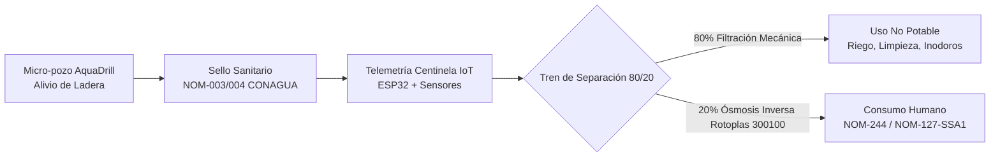

# 💧 Agua de GIA — AquaResiliencia Tijuana

> **Plataforma de Ciencia Comunitaria, Monitoreo Telemétrico IoT y Alivio Hídrico Descentralizado**  
> *Iniciativa enmarcada en el proyecto AquaResiliencia Tijuana / 1, 2, 3 por Tijuana.*  
> **Repositorio de Código Abierto, Especificaciones Técnicas y Datos Ambientales.**

[](LICENSE)
[](hardware/)
[](docs/)
[](#ciencia-comunitaria)

---

## 📌 1. El Problema: La Paradoja Hídrica y Geotécnica de Tijuana

La ciudad de Tijuana, Baja California, enfrenta una paradoja socioecológica y geotécnica severa:

```
┌────────────────────────────────────────────────────────────────────────────────────────┐
│                        LA PARADOJA HÍDRICA DE TIJUANA                                  │
├──────────────────────────────────────────┬─────────────────────────────────────────────┤
│      ESCENARIO SUPERFICIAL               │          ESCENARIO SUBSUPERFICIAL           │
├──────────────────────────────────────────┼─────────────────────────────────────────────┤
│ • Estrés hídrico extremo y tandeos.      │ • 30% a 40% del agua potable inyectada se  │
│ • Dependencia del Acueducto Río Colorado │   pierde por fugas en la red vieja (CESPT). │
│   (120 km, bombeo de +1,000 m de         │ • El agua fugada se infiltra y satura los   │
│   desnivel, alto costo energético).      │   horizontes someros en cañadas y laderas.  │
│ • Pipas de agua comercial a costos de    │ • Incremento crítico de la presión de poro  │
│   hasta 5 a 8 veces el agua de red.      │   en arcillas expansivas (Fm. Tijuana).     │
│ • Comunidades sin suministro continuo.   │ • Deslaves, colapsos y pérdida de viviendas.│
└──────────────────────────────────────────┴─────────────────────────────────────────────┘
```

### 1.1 Inestabilidad de Laderas por Sobresaturación
La geología urbana de Tijuana está dominada por alternancias de areniscas, limolitas y arcillas bentoníticas (*Formación Tijuana* y *Formación Rosarito Beach*). Cuando el agua proveniente de pérdidas de red y escorrentías urbanas penetra estas formaciones sin un drenaje adecuado:
1. Las arcillas se saturan y pierden su resistencia al esfuerzo cortante.
2. Se generan planos de falla geomecánica activos.
3. Se detonan deslizamientos catastróficos que han dejado sin hogar a cientos de familias en laderas urbanas (Lomas del Rubí, Camino Verde, Sánchez Taboada y cañadas costeras).

### 1.2 La Oportunidad
El agua que desestabiliza las laderas no es un desecho inservible: **es un recurso somero cautivo (acuífero colgado y freático superficial) que puede ser extraído de forma controlada como medida de alivio piezométrico, reduciendo el riesgo de derrumbe y abasteciendo a las comunidades locales.**

---

## ⚙️ 2. Solución Técnica Integral

El proyecto propone una intervención modular, frugal y científicamente regulada basada en cuatro pilares:



### 2.1 Micro-pozo de Alivio Piezométrico (Metodología AquaDrill)
* **Profundidad somera:** Entre 6 y 12 metros, interceptando mantos colgados y aluviones sin perforar estratos confinados profundos.
* **Perforación frugal y de bajo impacto:** Uso de sarta hidráulica ligera y motobomba de alta eficiencia, minimizando la perturbación del terreno en zonas de acceso peatonal o cañadas estrechas.
* **Ademe y empaque de grava:** Tubería de PVC hidráulico Cédula 40 de 4" (100 mm) con ranurado milimétrico fino (0.020"), protegido por empaque de grava sílica seleccionada para evitar arrastre de partículas y azolve.
* **Sello Sanitario Normado:** Sellado anular superior con **bentonita sódica de alta expansión** desde la superficie hasta los primeros 2.5 metros, cumpliendo estrictamente con las especificaciones de las normas oficiales **NOM-003-CONAGUA-1996** y **NOM-004-CONAGUA-1996** para proteger el pozo de filtraciones contaminantes superficiales.

### 2.2 Nodo Telemétrico Centinela IoT (ESP32)
Monitoreo y gobernanza algorítmica de la extracción para evitar la sobreexplotación del acuífero somero y garantizar la seguridad del agua:
* **Microcontrolador:** ESP32 DevKit v1 (30 pines) de bajo consumo, con conectividad Wi-Fi / MQTT y punto de acceso local de diagnóstico (`AquaResiliencia_AP`).
* **Sensor de Conductividad Eléctrica / TDS:** Monitoreo analógico continuo para detectar oportunamente cualquier intrusión de sales o contaminantes iónicos. Corte automático configurado a >1,800 ppm.
* **Sensor de Nivel Freático Dinámico:** Transductor ultrasónico impermeable IP67 (JSN-SR04T) que mide la columna de agua y detiene la extracción si el nivel desciende a menos de 2.0 m sobre la bomba.
* **Caudalímetro de Efecto Hall:** Sensor YF-S201 calibrado para contabilizar el volumen acumulado diario.
* **Actuador de Seguridad:** Relevador optoacoplado que energiza/desenergiza la bomba extractora, aplicando un límite diario de subsistencia comunitaria (500–600 L/día).

### 2.3 Tren de Tratamiento Físico-Químico 80/20
El agua subterránea somera extraída se divide de manera inteligente para maximizar la vida útil de los sistemas de filtración:
1. **Fracción 80% (Uso de Contacto Secundario y Doméstico General):**
   * Pasa por filtración de sedimentos (spun poly 5 micras) y decloración básica.
   * Destinada a riego de áreas verdes, limpieza comunitaria, mitigación de polvo y descarga de inodoros (conforme a parámetros de contacto secundario de la NOM-003-SEMARNAT-1997 / NOM-001-SEMARNAT-2021).
2. **Fracción 20% (Agua para Uso y Consumo Humano Directo):**
   * Tratamiento avanzado en punto de uso mediante equipo comercial de **Ósmosis Inversa Rotoplas 300100** certificado bajo **NOM-244-SSA1-2020** y estándar **NSF 58**.
   * Tren de 5 etapas: prefiltro de polipropileno (5 µm), carbón activado granular (GAC), carbón activado en bloque (CTO), membrana semipermeable de poliamida TFC (Thin Film Composite) y postfiltro pulidor remineralizador.
   * Lámpara germicida ultravioleta (UV 12W) para esterilización microbiológica final.

### 2.4 Certificación de Calidad del Agua (Laboratorio Acreditado EMA)
* Muestreo protocolizado bajo cadena de custodia formal.
* Ensayos analíticos ejecutados por laboratorio acreditado ante la **Entidad Mexicana de Acreditación (EMA)** para verificar el cumplimiento estricto de los límites máximos permisibles de la **NOM-127-SSA1-2021** (parámetros microbiológicos, metales pesados como As, Pb, Cd, nitratos, dureza, sulfatos y fluoruros).

---

## 📊 3. Datos Observados en Campo — Caso Piloto 001

El Caso Piloto 001 (ubicado en la zona general de **Playas de Tijuana, B.C.**) documenta observaciones directas de una experiencia real de campo, diferenciando con rigor científico entre datos observados, hipótesis y próximas etapas de instrumentación:

| Observación / Parámetro | Resultado de Campo | Metodología / Estado |
| :--- | :---: | :--- |
| **Zona General** | **Playas de Tijuana, B.C.** | Zona costera; litología aluvial y horizontes someros de ladera |
| **Profundidad alcanzada** | **~7.10 m** | Perforación asistida de bajo impacto (AquaDrill) |
| **Agua observada en reposo** | **~5.60 m** bajo superficie | Nivel freático estático observado en sondeo |
| **Columna de agua aproximada** | **~1.50 m** | Columna hídrica dentro de la perforación |
| **Entrada observada** | **Parte inferior** | Infiltración libre por estrato basal |
| **Material en el fondo** | **Grava pequeña y suelta** | Estrato permeable favorable para filtro anular |
| **Sistema de extracción de prueba** | **Bomba eléctrica de 12 V** | Extracción directa de bajo voltaje |
| **Volumen observado en prueba** | **~600 L en <24 h** | Volumen acumulado en ciclos de bombeo |
| **Recuperación observada** | **Del orden de segundos** | Recarga rápida del nivel tras cese de bombeo |
| **Prueba formal de rendimiento sostenible** | **Pendiente** | Aforo normado programado con instrumentación continua |
| **Análisis completo de calidad (NOM-127)** | **Pendiente** | Batería analítica en laboratorio EMA a financiar en Fase 1 |
| **Monitoreo continuo IoT** | **Próxima etapa** | Despliegue del nodo Centinela ESP32 con corte automático |

> **Principio rector:** *Encontrar agua no significa automáticamente encontrar agua potable. Primero medimos, caracterizamos y analizamos con rigor de laboratorio; después decidimos su aprovechamiento.*

---

## 💰 4. Metas de Financiamiento y Presupuesto

El proyecto opera con principios de máxima transparencia financiera, costos unitarios reales verificados y compras de equipo trazables (ver desglose pormenorizado en [`docs/presupuesto_detallado.md`](docs/presupuesto_detallado.md)):

```
┌────────────────────────────────────────────────────────────────────────────────────────┐
│                        RESUMEN DE METAS DE FINANCIAMIENTO                              │
├────────────────────────────────┬─────────────────┬─────────────────────────────────────┤
│ FASE                           │ META (MXN)      │ OBJETIVO CLAVE                      │
├────────────────────────────────┼─────────────────┼─────────────────────────────────────┤
│ Fase 1: Consolidación Piloto   │ $39,710.00 MXN  │ Laboratorio EMA NOM-127, tren RO    │
│                                │                 │ Rotoplas, kit telemetría y pozo 001 │
├────────────────────────────────┼─────────────────┼─────────────────────────────────────┤
│ Fase 2: Red Centinela (3 Nodos)│ $89,120.00 MXN  │ 3 pozos de alivio, bombeo solar,    │
│                                │                 │ telemetría celular y red de datos   │
├────────────────────────────────┼─────────────────┼─────────────────────────────────────┤
│ Fase 3: Integración Científica │ $148,500.00 MXN │ Enlace CICESE, homologación CONAGUA │
│         y Dominio Público      │                 │ y portal abierto para la ciudadanía │
└────────────────────────────────┴─────────────────┴─────────────────────────────────────┘
```

### 4.1 Resumen Ejecutivo por Fases

#### Fase 1: Consolidación Técnica y Certificación Oficial ($39,710 MXN)
* **Batería completa de análisis en laboratorio EMA (NOM-127-SSA1-2021):** $13,500 MXN.
* **Tren de purificación 20% (Ósmosis Rotoplas 300100 + UV + prefiltros):** $5,850 MXN.
* **Activo de cuadrilla (Motobomba 6.5 HP autocebante y mangueras):** $4,300 MXN.
* **Materiales de pozo (PVC 4" Céd. 40, bentonita sódica, grava sílica):** $3,120 MXN.
* **Hardware de telemetría IoT Centinela ESP32 (sensores, gabinete IP65, fuente):** $1,123.20 MXN.
* **Almacenamiento sanitario (depósito 450L grado alimenticio + accesorios plomería):** $4,816.80 MXN.
* **Mano de obra cuadrilla especializada (perforación, empaque, aforo y calibración):** $7,000 MXN.
* **Presupuesto consolidado: $39,710.00 MXN.**

#### Fase 2: Escalamiento a Red Centinela Comunitaria ($89,120 MXN)
* **Habilitación de 3 micro-pozos en laderas críticas de Tijuana:** $9,360 MXN.
* **Mano de obra cuadrilla (3 instalaciones de pozo):** $21,000 MXN.
* **Sistemas de energía solar autónoma para 3 nodos (paneles, control MPPT, batería):** $22,500 MXN.
* **Kits de telemetría IoT ESP32 Centinela (3 unidades completas):** $3,369.60 MXN.
* **Comunicaciones celulares industriales NB-IoT / LTE-M (SIMs multicarrier 1 año):** $4,800 MXN.
* **Campaña analítica EMA multicuenca (3 muestras analizadas bajo NOM-127):** $22,000 MXN.
* **Infraestructura de datos abiertos (Servidor MQTT/Node-RED/InfluxDB por 12 meses):** $3,890.40 MXN.
* **Reactivos de bioensayos ecotoxicológicos de campo y control de calidad:** $2,200 MXN.
* **Presupuesto consolidado: $89,120.00 MXN.**

#### Fase 3: Integración CICESE, Homologación CONAGUA y Portal de Dominio Público ($148,500 MXN)
* **Portal Web Comunitario y API Pública de Dominio Público:** Visualizador interactivo de mapas hidrológicos (GeoJSON/Leaflet), API REST sin autenticación para investigadores y descarga libre de series de tiempo (CSV/JSON).
* **Alianza Científica con CICESE (Centro de Investigación Científica y de Educación Superior de Ensenada):** Transmisión automatizada de datos piezométricos y geoquímicos para alimentar los modelos numéricos de flujo y balance del Acuífero Tijuana (0201).
* **Homologación Técnica y Reportes ante CONAGUA:** Integración de los micro-pozos como estaciones piezométricas ciudadanas de monitoreo somero, reportando niveles y calidad bajo estándares compatibles con RENAMECA y el Sistema Nacional de Información del Agua (SINA).
* **Análisis Isotópicos de Trazabilidad (δ18O / δ2H):** Determinación analítica para diferenciar con exactitud científica el porcentaje de agua proveniente de fugas de la red de agua potable (Río Colorado) vs. infiltración meteórica natural vs. intrusión salina.
* **Presupuesto consolidado: $148,500.00 MXN.**

---

## 👥 5. Equipo Multidisciplinario y Red Científica

AquaResiliencia Tijuana articula el modelo de innovación de la **Cuádruple Hélice** (Comunidad, Academia, Sector Tecnológico y Entorno Regulador):

### 5.1 Dirección Técnica y Operativa
* **Pablo (Dirección Técnica y Desarrollo de Campo):** Diseño mecánico del sistema de perforación frugal AquaDrill, integración de campo, coordinación de cuadrillas y despliegue del hardware de telemetría.

### 5.2 Red Científica y Asesores de Investigación (Comité Consultivo)
* **Asesoría en Hidrogeología y Calidad de Agua Subterránea:** Especialistas del consorcio científico regional (CICESE / UABC), coordinando modelos de flujo subterráneo somero, balance de recarga y prevención de intrusión salina en acuíferos costeros.
* **Asesoría en Fitodepuración y Ecología Urbana:** Investigadores especialistas de El Colegio de la Frontera Norte (COLEF), modelando la absorción de nutrientes y fitofiltración en la fracción del 80% para parques públicos y áreas verdes.
* **Asesoría en Políticas Públicas y Gobernanza del Agua:** Académicos en derecho ambiental, cuencas transfronterizas y sistemas comunitarios amparados en la Ley General de Aguas.
* **Ingeniería de Sistemas Embebidos y Datos Abiertos:** Desarrolladores de firmware abierto, protocolos MQTT y arquitecturas de tableros comunitarios en tiempo real.

---

## 🔬 6. Ciencia Comunitaria y Datos Abiertos

Este repositorio sigue los principios de:
1. **Hardware Libre y Replicable:** Los diagramas, códigos y listas de materiales son públicos para que cualquier comunidad vulnerable frente a deslaves o sequía pueda auditar o replicar el sistema.
2. **Protección Estricta de la Privacidad:** La telemetría reporta únicamente variables ambientales físicas (conductividad, niveles de agua, volumen). Las ubicaciones de los pozos se reportan agrupadas por cuenca/polígono general, preservando en todo momento la privacidad de los predios particulares.
3. **Validación sin Secretismos:** Toda afirmación de potabilidad debe estar respaldada por un folio de laboratorio acreditado ante la EMA; en su ausencia, el agua se clasifica estrictamente como no potable para contacto secundario.

---

## 🚀 7. Estructura del Repositorio

```
aguadegia/
├── .gitignore                      # Filtro de seguridad (claves, binarios, .env)
├── README.md                       # Manifiesto técnico y visión general
├── docs/
│   └── presupuesto_detallado.md    # Tablas desglosadas con precios oficiales verificados
└── hardware/
    └── config.example.h            # Plantilla C++ con pinout, MQTT y umbrales de seguridad
```

---

## 📄 8. Licencia

Este proyecto está bajo la Licencia **MIT**. Consulta el archivo `LICENSE` para más detalles.  
El conocimiento y los datos generados pertenecen a las comunidades de Tijuana.
